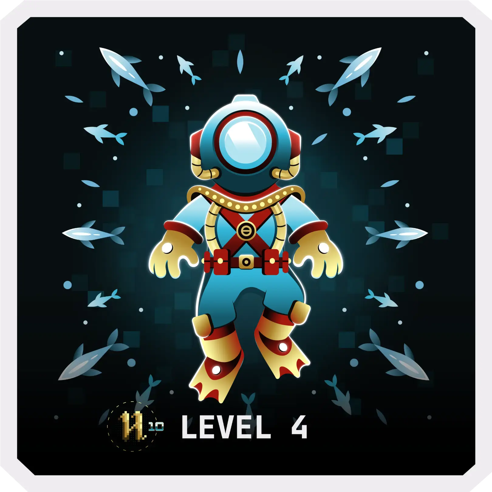

<!--suppress HtmlDeprecatedAttribute -->

# 👋 Hey, glad to see you!

&nbsp;

&nbsp;

&nbsp;

&nbsp;
 
&nbsp;

<!-- 

-->

 

<!-- contacts -->

<strong>Contact me</strong>: <!---->

<!-- statistics -->

<!-- wakayime statistics -->
<!-- activity graph heroku-app start  

    
    

activity graph heroku-app end -->

<!--

-->

<!--

    

-->

